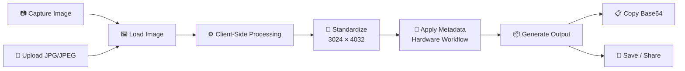

# 🕶️ Meta Hardware EXIF Converter

<p align="center">
  
  
  
  
</p>

<p align="center">
  <strong>A lightweight, client-side image conversion tool inspired by Meta hardware imaging workflows.</strong>
</p>

<p align="center">
  <a href="https://prafull-chauhan.github.io/Meta/">
    
  </a>
</p>

---

## ✨ Overview

**Meta Hardware EXIF Converter** is a modern browser-based utility designed to standardize images and prepare them with a predefined hardware-oriented metadata workflow.

The application provides a simple interface for:

* 📷 Capturing an image directly from the device
* 📁 Uploading JPG/JPEG images
* 🖼️ Standardizing images to **3024 × 4032 px**
* 🧩 Applying the configured hardware metadata workflow
* 📦 Exporting the processed image
* 🔐 Performing processing entirely inside the browser
* 📋 Copying generated Base64 data
* 📤 Saving or sharing the resulting image

> **No image needs to be uploaded to a server for the core processing workflow.**

---

## 🌐 Live Website

### 🚀 [Open Meta Hardware EXIF Converter](https://prafull-chauhan.github.io/Meta/)

Experience the application directly in your browser.

---

## 🎯 Key Features

| Feature                            | Description                                             |
| ---------------------------------- | ------------------------------------------------------- |
| 📷 **Camera Capture**              | Capture imagery directly from a compatible device       |
| 📁 **File Upload**                 | Select or drag-and-drop JPG/JPEG files                  |
| 🖼️ **Resolution Standardization** | Converts output to `3024 × 4032 px`                     |
| 🧩 **Hardware Signature**          | Applies the configured Ray-Ban Meta 2 metadata workflow |
| ⚡ **Client-Side Processing**       | Processing happens locally inside the browser           |
| 🔒 **Privacy Focused**             | No server-side image processing required                |
| 📋 **Base64 Export**               | Copy processed image data                               |
| 💾 **Save / Share**                | Export the resulting image directly                     |
| 📱 **Responsive UI**               | Designed for desktop and mobile environments            |

---

## 🧠 How It Works



### Processing Pipeline

```text
INPUT
  │
  ├── Camera Capture
  │
  └── JPG / JPEG Upload
          │
          ▼
   ┌─────────────────┐
   │ Image Processing │
   └────────┬────────┘
            ▼
   ┌─────────────────┐
   │ 3024 × 4032     │
   │ Standardization │
   └────────┬────────┘
            ▼
   ┌─────────────────┐
   │ Hardware Metadata│
   │ Workflow         │
   └────────┬────────┘
            ▼
       OUTPUT IMAGE
        │        │
        ▼        ▼
     Base64   Save/Share
```

---

## 🔐 Privacy by Design

One of the core principles of the project is keeping image processing on the client.

```text
             YOUR DEVICE
┌─────────────────────────────────────┐
│                                     │
│  📷 Camera / 📁 Image               │
│             │                       │
│             ▼                       │
│      Browser Processing             │
│             │                       │
│       ┌─────┴─────┐                 │
│       │           │                 │
│       ▼           ▼                 │
│   Conversion   Metadata              │
│       │           │                 │
│       └─────┬─────┘                 │
│             ▼                       │
│        Final Image                  │
│                                     │
└─────────────────────────────────────┘

          🚫 No required upload
          🚫 No image server
          🚫 No backend dependency
```

---

## 🛠️ Technology Stack

### Frontend

<p>

</p>

* **HTML5** — semantic application structure
* **CSS3** — responsive interface and visual styling
* **JavaScript** — image processing and application logic
* **Browser APIs** — local file and camera interaction

### Deployment

<p>

</p>

The project is deployed through **GitHub Pages**, making the application accessible directly from the browser without requiring a traditional backend server.

---

## 📐 Output Specification

| Property         | Value          |
| ---------------- | -------------- |
| Input            | JPG / JPEG     |
| Target Width     | `3024 px`      |
| Target Height    | `4032 px`      |
| Aspect Ratio     | `3:4`          |
| Processing       | Client-side    |
| Server Required  | ❌ No           |
| Hardware Profile | Ray-Ban Meta 2 |

---

## 📸 User Workflow

### 01 — Select Your Image

Choose an existing JPG/JPEG image or capture one directly using the device camera.

### 02 — Process

The application performs the conversion and prepares the image according to the configured output specification.

### 03 — Export

Copy the generated Base64 representation or save/share the resulting image.

---

## 💻 Running Locally

Clone the repository:

```bash
git clone https://github.com/prafull-chauhan/Meta.git
```

Navigate into the project:

```bash
cd Meta
```

Then open the HTML file directly in your browser or serve the directory using a local development server.

For example:

```bash
python -m http.server 8000
```

Then open:

```text
http://localhost:8000
```

---

## 📂 Project Structure

```text
Meta/
│
├── index.html
├── style.css
├── script.js
│
├── assets/
│   └── ...
│
└── README.md
```

> Adjust the structure above if your repository uses different filenames or folders.

---

## ⚡ Performance Philosophy

The project is intentionally lightweight.

Instead of relying on a large backend architecture, the application focuses on:

```text
Minimal Dependencies
        +
Client-Side Processing
        +
Simple UI
        +
Fast Execution
        ↓
Lightweight Web Utility
```

This makes the project suitable for quick image preparation without introducing unnecessary infrastructure.

---

## 🧪 Browser Compatibility

The application relies on modern browser capabilities such as:

* File APIs
* Canvas/image processing
* Camera access where supported
* Clipboard functionality
* Download/share capabilities

For the best experience, use a modern version of:

* Chrome
* Edge
* Firefox
* Safari

---

## 🚀 Future Improvements

Potential improvements for future versions:

* [ ] Batch image processing
* [ ] Advanced EXIF inspection
* [ ] EXIF metadata editor
* [ ] Metadata preview before export
* [ ] Drag-and-drop improvements
* [ ] Progressive Web App support
* [ ] Offline installation
* [ ] Additional hardware profiles
* [ ] Image quality/compression controls
* [ ] Processing history
* [ ] Dark/light theme customization
* [ ] More export formats

---

## ⚠️ Disclaimer

This is an independent personal project created for experimentation, learning, and image-processing workflows.

**Meta**, **Ray-Ban**, and related trademarks belong to their respective owners. This project is not affiliated with, endorsed by, or officially associated with Meta Platforms, Inc. or Ray-Ban.

---

## 👨‍💻 Author

### **Prafull Chauhan**

Built with curiosity, experimentation, and a lot of JavaScript.

<p align="center">
  <a href="https://github.com/prafull-chauhan">
    
  </a>
</p>

---

## ⭐ Support

If you find this project useful or interesting, consider giving the repository a ⭐.

It helps the project get noticed and motivates further development.

---

<p align="center">

### 🕶️ Built for the web. Processed in your browser.

**[🚀 Launch Website](https://prafull-chauhan.github.io/Meta/)**

</p>

<p align="center">
  <sub>© 2026 Prafull Chauhan · Built with HTML, CSS & JavaScript</sub>
</p>
